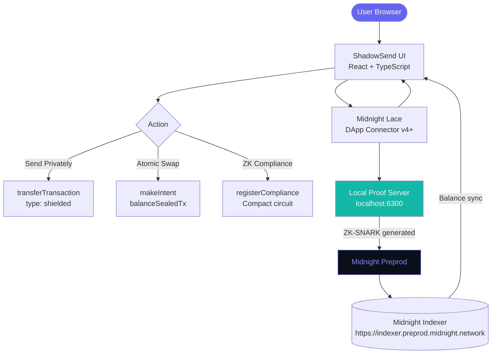

# 👻 ShadowSend — Privacy-First DeFi on Midnight Network

[](https://midnight.network)
[](https://opensource.org/licenses/MIT)
[](https://midnight.network)
[](https://midnight.network)

> **Privacy is not a feature on ShadowSend — it's the foundation.**

**ShadowSend** is the #1 privacy-first DeFi dApp on **Midnight Network**, built for the [Into the Midnight Hackathon 2026](https://midnight.network). Using Midnight's native ZK-SNARK primitives (Zswap), ShadowSend enables shielded token transfers, atomic private swaps, and ZK compliance proofs — where amounts, recipients, and transaction metadata are cryptographically hidden by default.

---

## 🎥 Submission Links

| Resource | Link |
| :--- | :--- |
| 🌐 **Live Demo** | [shadowsend.vercel.app](https://shadowsend.vercel.app/) |
| 🎬 **Demo Video** | [ShadowSend Demo](https://docs.google.com/presentation/d/1h4nY2MAzta08UREP494CqoZyVh64QY7e/edit) |
| 📊 **Presentation** | [ShadowSend PPT](https://docs.google.com/presentation/d/1h4nY2MAzta08UREP494CqoZyVh64QY7e/edit) |
| 🐙 **GitHub** | [NikhilRaikwar/ShadowSend](https://github.com/NikhilRaikwar/ShadowSend) |
| 🐦 **Twitter** | [@NikhilRaikwarr](https://x.com/NikhilRaikwarr) |

---

## 🏆 Why ShadowSend Wins

ShadowSend is the **first consumer-ready private remittance and swap protocol on Midnight** that uses the full ZK stack natively — not a coprocessor bolt-on.

| Feature | ShadowSend | Standard DeFi |
|---|---|---|
| Transaction Amounts | ✅ ZK-hidden | ❌ Publicly visible |
| Recipient Addresses | ✅ ZK-hidden | ❌ Publicly visible |
| Atomic Swaps | ✅ Anti-MEV by design | ❌ Front-runnable |
| AML Compliance | ✅ ZK proof (amount hidden) | ❌ Manual / transparent |
| Privacy Layer | ✅ Protocol-native (Zswap) | ❌ Bolt-on / optional |

---

## 🏗️ Architecture



### ZK Transaction Flow

```
User Input          Private Witness        ZK Circuit            On-Chain
(amount +    →     (stays client-side) →  (Compact contract) →  Only opaque
 recipient)        never leaves browser    generates SNARK        ZK proof
```

**What's hidden on-chain:** amount ✓ | sender ✓ | recipient ✓ | swap details ✓

**Still provable on-chain:** sender has balance ✓ | no tokens created ✓ | valid proof ✓

---

## ✨ Features

### 🔒 Send Privately (Hero Feature)
- Shielded transfers using Midnight's native Zswap protocol
- Both **amount AND recipient** cryptographically hidden via ZK-SNARKs
- Multi-recipient batch sending in a single transaction
- Toggle between shielded and unshielded modes
- **Real-time privacy preview**: "Amount hidden • Recipient hidden • ZK proof ✓"

### ⚛️ Atomic Private Swaps
- ZK intent-based atomic swap flow (`makeIntent` + `balanceSealedTransaction`)
- **Anti-MEV by design** — swap details hidden inside SNARK
- Shielded-only outputs — no mixed unshielded leakage
- Atomic settlement: all-or-nothing, no partial fills

### 📊 Privacy Dashboard
- Live tNIGHT (shielded + unshielded) balance breakdown
- **Deep State Indicators**: Real-time tracking of `Available` vs `Pending` coins in the ZK-Pool
- tDUST balance monitoring (auto-generated from tNIGHT UTXOs)
- Private transaction history — only your wallet can decrypt
- One-click TX-SCAN link to Midnight Explorer
- Auto-refresh every 15 seconds via Indexer API v4

---

## 🛠️ Tech Stack

| Layer | Technology |
| :--- | :--- |
| **Smart Contracts** | Compact (Midnight) — ZK circuits |
| **ZK Proofs** | Midnight Proof Server (Docker) — local proving |
| **Wallet** | Midnight Lace + DApp Connector v4+ |
| **Network** | Midnight Preprod (`https://indexer.preprod.midnight.network/api/v4/graphql`) |
| **Frontend** | React 18 + TypeScript + Vite |
| **Styling** | Tailwind CSS + Framer Motion + glassmorphic dark UI |

---

## 📦 Installation & Setup

### 1. Clone & Install

```bash
git clone https://github.com/NikhilRaikwar/ShadowSend.git
cd ShadowSend
npm install
```

### 2. Start Proof Server (Required for ZK proofs)

```bash
docker run -d --name shadowsend-proof \
  -p 6300:6300 \
  ghcr.io/midnight-ntwrk/proof-server:8.0.3
```

### 3. Launch

```bash
npm run dev -- --port 3001
# Open http://localhost:3001
# Connect Lace wallet → select Preprod network
```

---

## 📜 Compact Contract Circuits

| Circuit | Purpose | Privacy |
|---|---|---|
| `sendShielded` | Private tNIGHT/NIGHT transfer | Amount + recipient hidden |
| `receiveShieldedDeposit` | Accept shielded deposit | Full privacy |
| `registerCompliance` | ZK AML proof | Amount hidden, only status disclosed |
| `initiateSwap` | Create shielded swap offer | Offer hidden in SNARK |
| `cancelSwap` | Cancel open swap | Atomic cancel |
| `completeSwap` | Atomic shielded swap settlement | Both legs hidden |

---

## 🗺️ Roadmap

### ✅ Phase 1 — Foundation (Q2 2026, Hackathon)
- [x] Shielded tNIGHT transfers (amount + recipient hidden)
- [x] Atomic private swaps (ZK intent-based)
- [x] Privacy Dashboard (live balance + TX history)
- [x] Midnight Lace DApp Connector integration
- [x] Multi-recipient batch shielded sends
- [x] Glassmorphic dark UI (production-ready)

### 🔜 Phase 2 — Compliance Layer (Q3 2026)
- [ ] Full Compact contract deployment to Preprod
- [ ] `registerCompliance` ZK circuit live on-chain
- [ ] Selective disclosure API (AML-only mode)

---

## 🤝 Hackathon Submission

**Event:** Into the Midnight Hackathon 2026  
**Track:** Finance & DeFi  
**Builder:** [@NikhilRaikwarr](https://x.com/NikhilRaikwarr)  
**Live:** [shadowsend.vercel.app](https://shadowsend.vercel.app/)

---

## 📄 License

MIT License — see [LICENSE](LICENSE)

*© 2026 ShadowSend. Protected by Midnight ZK.*
