# 🌌 ShadowSend: Elite Private DeFi for Midnight

[](https://midnight.network)
[](https://docs.midnight.network)
[](LICENSE)

**ShadowSend** is a state-of-the-art DApp built on the Midnight Network, providing institutional-grade privacy for digital asset transfers and atomic swaps. By leveraging Zero-Knowledge Proofs (ZKP), ShadowSend ensures that your financial identity remains shielded while maintaining 100% cryptographic integrity.

```mermaid
graph TD
    A[User Wallet: Lace] -->|ZK Intent| B[ShadowSend DApp]
    B -->|Sealed Tx| C[Midnight Proof Server]
    C -->|ZK Proof| D[Midnight Ledger]
    D -->|Private Settlement| E[Shielded Recipient]
    style B fill:#5b21b6,stroke:#a78bfa,stroke-width:2px
    style C fill:#1e293b,stroke:#3b82f6,stroke-width:2px
```



## 🛠️ Core Features

| Feature | Description | Security Model |
| :--- | :--- | :--- |
| **Shielded Send** | Hide transaction amount and recipient identity. | Zero-Knowledge (ZKP) |
| **Atomic Swap** | Trustless exchange of tNIGHT tokens without counterparty risk. | Smart Contract Guided |
| **DUST Energy** | Auto-generating fuel system for paying ZK fees. | Identity-linked |
| **ZK Compliance** | Prove you are not blacklisted without revealing your balance. | Selective Disclosure |

## 🚀 Technical Stack

- **Smart Contract**: Compact (v0.15)
- **Frontend**: React 18 + Vite (Production Optimized)
- **Styling**: TailwindCSS + Framer Motion (Glassmorphism)
- **SDK**: Midnight DApp Connector API (V4 Alignment)
- **Proving**: Local Proof Server (Docker-ready)

## ⚡ Getting Started (Onboarding)

### 1. Requirements
- **Midnight Lace Wallet**: [Download here](https://midnight.network)
- **Docker**: For running the proving server.
- **Node.js**: v18.x or higher.

### 2. Setup
```bash
# Clone the repository
git clone https://github.com/NikhilRaikwar/ShadowSend
cd ShadowSend

# Install dependencies
npm install

# Start the Midnight Proof Server (Required for ZK)
docker run -d -p 6300:6300 ghcr.io/midnight-ntwrk/proof-server:8.0.3

# Run in Development mode
npm run dev
```

### 3. Faucet & DUST
1. Obtain `tNIGHT` from the [Midnight Faucet](https://faucet.preprod.midnight.network).
2. Use the **ShadowSend Dashboard** to "Initialize DUST Energy".
3. Wait 1-2 blocks for your tNIGHT to start generating tDUST energy.

## 🗺️ Roadmap (V1.0)

- [x] **Phase 1**: Core Shielded Transfer Integration (SDK V4).
- [x] **Phase 2**: Atomic Swap Protocols via `makeIntent`.
- [x] **Phase 3**: Real-time Identity Persistence & Balance Tracking.
- [ ] **Phase 4**: Multi-Asset Privacy Pools (Custom tokens).

---

Built with 🖤 for the **Midnight Network Hackathon 2026**.
