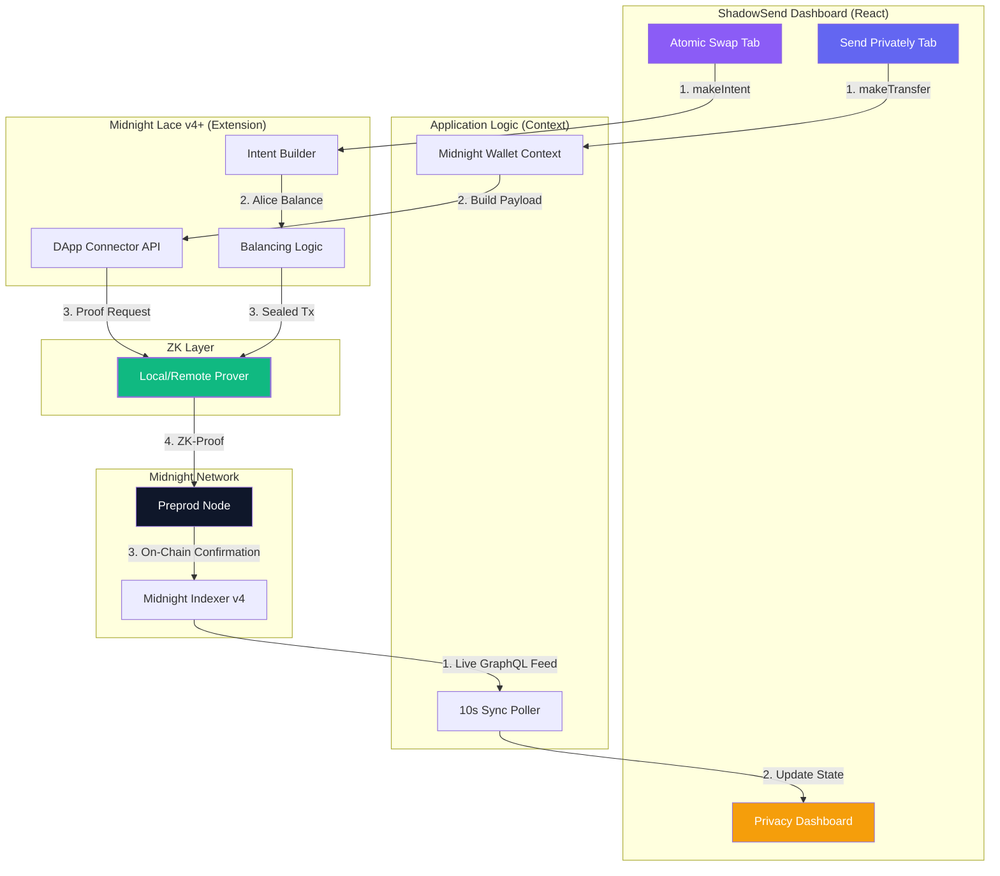

# 🌑 ShadowSend: Privacy-First DeFi on Midnight

[](https://midnight.network)
[](https://opensource.org/licenses/MIT)
[](https://midnight.network)
[](https://midnight.network)
[](https://shadowsend.vercel.app)

> **Privacy as a Default. Not an Afterthought.**

**ShadowSend** is a next-generation privacy dApp built on the **Midnight Network**. It leverages Zero-Knowledge (ZK) proofs to enable anonymous asset transfers and atomic swaps — ensuring that your financial data remains your own business, enforced by mathematics, not promises.

---

## 🎥 Demo & Submission Links

| Resource | Link |
| :--- | :--- |
| 🎬 **Demo Video** | [Watch Demo](https://youtu.be/KJ8U70i7r6Q) |
| 📊 **Presentation (PPT)** | [View Slides](https://docs.google.com/presentation/d/1Pzq_xL7cikPCxJ9HY_4yjJ7NUnwhqO7LS74zEXajCx4/edit?usp=sharing) |
| 🐙 **GitHub** | [NikhilRaikwar/ShadowSend](https://github.com/NikhilRaikwar/ShadowSend) |
| 🌐 **Live dApp** | [shadowsend.vercel.app](https://shadowsend.vercel.app) |
| 🐦 **Builder** | [@NikhilRaikwarr](https://x.com/NikhilRaikwarr) |

---

## 🚀 Key Features

### 🔒 Shielded Transfers
Send tokens privately where **both the recipient address AND the amount are cryptographically hidden** via ZK-SNARKs:
- Shielded → Shielded (`mn_shield-addr_preprod` destinations)
- Unshielded → Shielded (shield your existing assets)
- **Multi-recipient batching** in a single shielded transaction
- Auto-detection of address type from prefix

### ⚛️ Atomic Private Swaps
Exchange assets privately using **ZK intent-based atomic swaps**:
- Zero front-running risk — trade details inside a ZK-SNARK
- Anti-MEV by design: mempool observers see nothing
- `makeIntent()` + `balanceSealedTransaction()` → fully atomic
- Either completes fully or rolls back — no partial exposure

### 📊 Privacy Dashboard
Real-time breakdown of your privacy status:
- **Private Pool** (shielded tNIGHT) vs **Public Pool** (unshielded tNIGHT)
- **tDUST Energy** tracker — hold tNIGHT to generate ZK proving fuel
- Live transaction history synced from Midnight Indexer GraphQL
- Pending tx detection with on-chain confirmation tracking
- Auto-refresh every 10 seconds

### 🛡️ Dual Privacy Modes
Per-transaction control:
- **Shielding Active** — amounts and recipients cryptographically hidden
- **Public Mode** — standard unshielded transaction for transparency when needed

### 🌉 Cross-Chain Bridge *(Coming in Phase 2)*
Secure, private bridging from Ethereum, Polygon, Arbitrum, Optimism → Midnight Network.

---

## 🏗️ Architecture & Functional Flow



### ZK Transaction Flow

```
1. User fills form    →   2. Lace builds SNARK   →   3. Tx submitted    →   4. Confirmed on-chain
   (addr + amount)         (all data encrypted)       (opaque ZK proof)      (balances updated)
       ↓                         ↓                           ↓                      ↓
  Validated locally        Keys never leave            No metadata         Live Dashboard sync
                           the browser                 exposed             via Midnight Indexer
```

---

## 🛠️ Technology Stack

| Component | Technology |
| :--- | :--- |
| **Blockchain** | Midnight Network (Preprod Testnet) |
| **Wallet Connector** | Midnight Lace (Official DApp Connector) |
| **Zero-Knowledge** | Compact / ZK-SNARKs (via Lace) |
| **Frontend Framework** | React 18 + TypeScript |
| **Styling** | Tailwind CSS + Custom Glass UI System |
| **Animations** | Framer Motion |
| **State Management** | React Context API + TanStack Query |
| **Notifications** | Sonner |
| **Icons** | Lucide React |
| **Build Tool** | Vite |
| **Analytics** | Vercel Analytics |
| **Hosting** | Vercel |

### Native Asset

ShadowSend uses the **native tNIGHT asset** on Midnight Preprod:

```
Native Asset ID: 0000000000000000000000000000000000000000000000000000000000000000
```

No custom contract deployment required. Midnight Lace handles all ZK proof generation natively.

---

## 📦 Installation & Setup

### Prerequisites
- Node.js 18+
- Yarn
- **[Midnight Lace Wallet](https://midnight.network)** browser extension
- Wallet configured on **Midnight Preprod** network

### 1. Clone
```bash
git clone https://github.com/NikhilRaikwar/ShadowSend.git
cd ShadowSend
```

### 2. Install
```bash
yarn install
```

### 3. Launch
```bash
yarn dev --port 3001
```

Open `http://localhost:3001` in your browser.

### Environment Checklist
- ✅ Midnight Lace installed and unlocked
- ✅ Wallet on **Midnight Preprod** network
- ✅ Midnight Indexer accessible (auto-configured to `https://indexer.preprod.midnight.network`)
- ✅ tNIGHT testnet tokens in wallet

---

## 🔐 How to Use

### Send Privately
1. **Connect Wallet** → Midnight Lace opens → Approve on Preprod
2. **Enter recipient** — prefix auto-detects mode:
   - `mn_shield-addr_preprod1...` → Shielded transfer
   - `mn_addr_preprod1...` → Public transfer
3. **Enter amount** (tNIGHT, supports decimals)
4. **Toggle Shielding** ON (default) for ZK-encrypted transfer
5. **Click "Send Shielded"** → Lace generates proof → tx submitted
6. **View confirmation** in Privacy Dashboard

### Swap Privately
1. Connect wallet
2. Enter swap amount
3. Click **"Finalize Swap"**
4. Wallet builds + balances intent → atomic swap executes with zero exposure

### Multi-Recipient Batch Send
1. Click **+** to add recipients
2. Enter unique address + amount per recipient
3. Single shielded transaction covers all

---

## 🛡️ Security Design

| Property | Implementation |
| :--- | :--- |
| **Non-Custodial** | Private keys never leave Midnight Lace wallet |
| **ZK Proof Generation** | Happens client-side inside the Lace extension |
| **Zero Data Storage** | No user data stored server-side. Ever. |
| **Address Validation** | Strict prefix check before any wallet call |
| **Amount Precision** | Converted to microunits (×1,000,000) |
| **Open Source** | 100% auditable on GitHub |
| **Auto-Refresh** | Balance polling every 10s, not on every interaction |

---

## 🗺️ Roadmap

### ✅ Phase 1 — Core Privacy Protocol *(Hackathon 2026 — COMPLETED)*
- [x] Shielded token transfers via ZK-SNARKs
- [x] Atomic private swaps with ZK intents
- [x] Real-time Privacy Dashboard with live Indexer sync
- [x] Full Midnight Lace DApp Connector integration
- [x] Multi-recipient batch shielded sends
- [x] Dual privacy modes (Shielded / Public toggle)
- [x] tDUST balance tracking
- [x] Vercel deployment + Vercel Analytics

### 🔵 Phase 2 — Cross-Chain Bridge & Mainnet *(Q2–Q3 2026)*
- [ ] Private bridge: Ethereum → Midnight Network
- [ ] Support for Polygon, Arbitrum, Optimism
- [ ] Mainnet deployment on Midnight Genesis
- [ ] Batch ZK proof optimization (reduce proving latency)
- [ ] Mobile-responsive PWA version
- [ ] Transaction history persistence (IndexedDB)

### 🌙 Phase 3 — Privacy SDK & Ecosystem *(Q4 2026)*
- [ ] Open-source ShadowSend SDK for other developers
- [ ] Private AMM liquidity pools with ZK
- [ ] Shielded NFT transfers on Midnight
- [ ] DAO governance for protocol parameters
- [ ] Privacy-as-a-Service API for third-party dApps

### ⭐ Phase 4 — Full Privacy Infrastructure *(2027+)*
- [ ] Native ShadowSend token + staking rewards
- [ ] Privacy DEX aggregator across chains
- [ ] Institutional-grade shielded transaction tooling
- [ ] ShadowSend as Midnight Network's canonical privacy layer

---

## 📁 Project Structure

```
ShadowSend/
├── src/
│   ├── components/
│   │   ├── SendPrivatelyTab.tsx    # Multi-recipient shielded send
│   │   ├── SwapTab.tsx             # Atomic private swap (with balanceSealedTx)
│   │   ├── PrivacyDashboard.tsx    # Balance + tx feed (tNIGHT + tDUST)
│   │   ├── WalletConnectButton.tsx # Lace wallet integration
│   │   ├── TokenSelector.tsx       # tNIGHT / tDUST picker
│   │   ├── BridgeTab.tsx           # Coming Soon placeholder
│   │   ├── Navbar.tsx
│   │   ├── Footer.tsx
│   │   └── GhostLogo.tsx           # Animated ghost brand mark
│   ├── contexts/
│   │   └── MidnightWalletContext.tsx  # Full wallet state + API
│   ├── pages/
│   │   ├── Index.tsx               # Main dApp shell
│   │   └── NotFound.tsx
│   └── index.css                   # Glass UI design system + CSS vars
└── public/
    └── shadowsend.png              # Ghost logo asset
```

---

## 🤝 Hackathon Submission

Built with ❤️ for the **Midnight Network Hackathon 2026**.

**Builder:** [@NikhilRaikwarr](https://x.com/NikhilRaikwarr)

### What We Built
- ✅ Shielded transfers with ZK-SNARK proof generation via Lace
- ✅ Atomic private swaps using `makeIntent` + `balanceSealedTransaction`
- ✅ Real-time Privacy Dashboard with Midnight Indexer sync
- ✅ Full Midnight Lace DApp Connector integration
- ✅ Multi-recipient batch shielded sends
- ✅ tDUST energy tracking alongside tNIGHT
- ✅ Production-grade UI deployed on Vercel

### Why It Matters
DeFi today is completely transparent — every balance, trade, and transaction pattern is permanently public. ShadowSend demonstrates that **financial privacy is achievable on a public blockchain** using zero-knowledge cryptography. Midnight Network makes this cryptographically sound. We made it user-accessible.

Privacy isn't a niche requirement — it's a fundamental right. ShadowSend makes it a default.

---

## 📄 License

MIT License — see [LICENSE](LICENSE) for details.

---

*© 2026 ShadowSend Team. Protected by Midnight ZK.*
